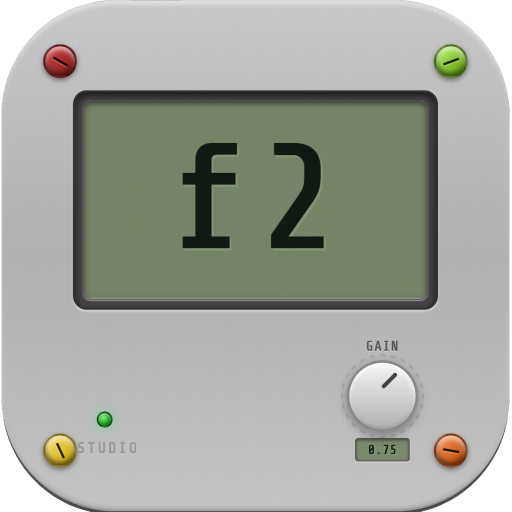
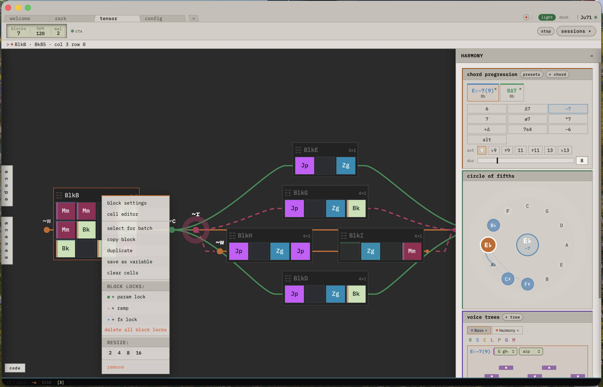
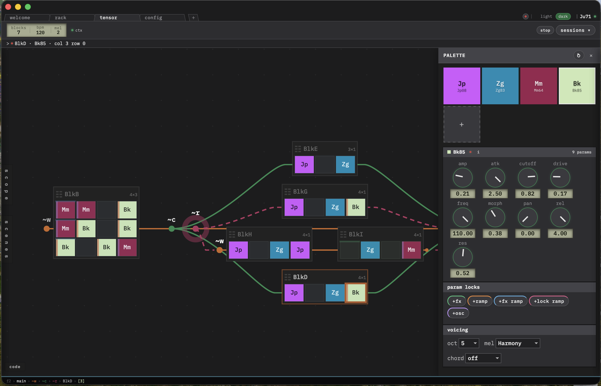
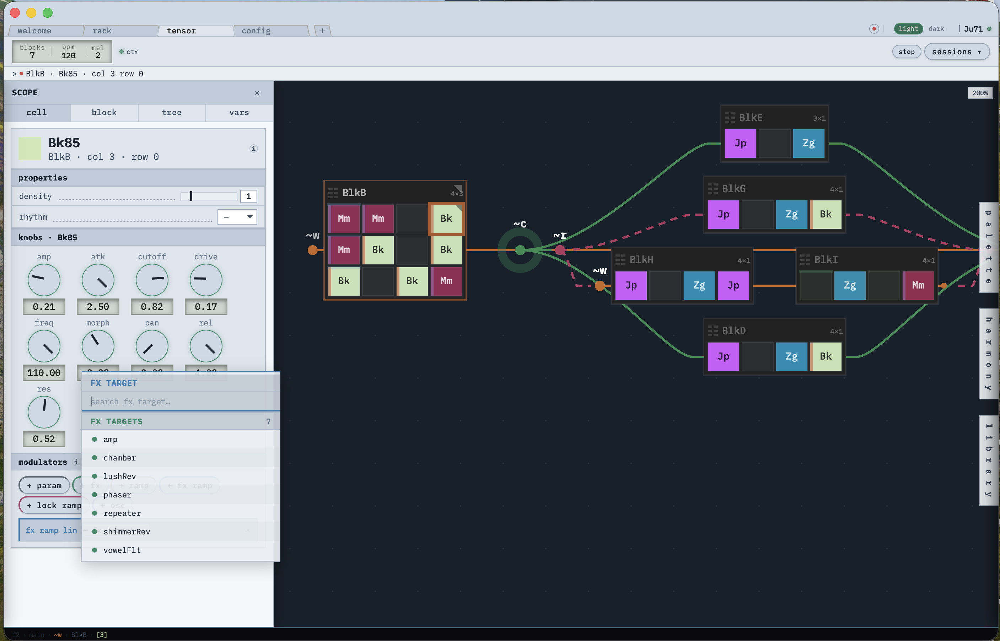
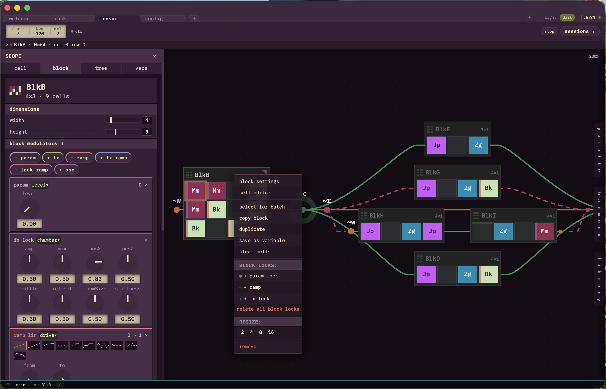

<p align="center">
  
</p>
<p align="center">
  The weirdest and the most effective DAW, based on SuperCollider, made for algorithmic sound design
</p>
<p align="center">
  
  
  
  
  
  
</p>

---

## You can toggle between Bright and Dark

<p align="center">
  <a href="/docs/images/shot1.png">
    
  </a>
  <a href="docs/images/shot2.png">
    
  </a>
  <a href="docs/images/shot3.png">
    
  </a>
  <a href="docs/images/shot4.png">
    
  </a>
</p>

---

## Install

F2 **drives the SuperCollider on your machine and does not ship its own**, so SC
comes first. Without it the app opens and the engine never boots.

| system  | SuperCollider 3.13+                                                          |
| ------- | ---------------------------------------------------------------------------- |
| macOS   | [download](https://supercollider.github.io/downloads), or `brew install --cask supercollider` |
| Linux   | `apt install supercollider` · `dnf install supercollider`                     |
| Windows | the installer from [supercollider.github.io](https://supercollider.github.io/downloads) |

Optional: **sc3-plugins**. Without it the engine loads and plays, and two things
degrade, each saying so once in the post window: the Sampler's Spectral mode
falls back to a simpler algorithm, and four of the eleven filter models (`sk`,
`svf`, `fizz`, `ripple`) are not built — a save asking for one plays the unit's
default model, and the card marks them. Everything else is unaffected.

Then take the installer for your system from the releases page: `.deb`, `.rpm`
or `.AppImage` on Linux, `.dmg` on macOS (one universal build for both Intel
and Apple Silicon), `.msi` or the NSIS `.exe` on Windows.

If F2 cannot find SuperCollider, point it at the binary with the `F2_SCLANG`
environment variable.

---

## Documentation

- **[docs/wiki/](docs/wiki/)** — the wiki: 29 pages covering the paradigm, the
  runtime, every element of the interface, the modulation system, the built-in
  synth library, and how to write your own instruments and effects. Start at
  [Home](docs/wiki/Home.md) and [Philosophy](docs/wiki/Philosophy.md); it is
  also published as this repository's GitHub Wiki.
- A Russian translation of the older single-file manual is kept at
  `docs/manuals/MANUAL.ru.md`. It predates the wiki and is no longer updated.

---

## Workflow

f2 is built around a tree-based pattern sequencer that compiles to
SuperCollider's JITLib pattern system. The core loop is: build a tree of blocks
→ f2 compiles it to SC code → SC plays it live. Everything is hot-swappable.

### 1. Create a project

Open f2, go to the **Welcome** tab, create or select a project. A project is a
folder on disk with this structure (see [Project Structure](#project-structure)
below). f2 boots SuperCollider automatically, loads your synths, effects, and
samples.


click on the boot button:


check the logs in shell tab:


### 2. Build a sound in the Tensor canvas

The **Tensor** tab is your main workspace — an infinite 2D canvas where you
place **blocks**. Each block is a grid of cells. Each cell holds a preset
(instrument + parameters). Right-click or double-click empty space to add
blocks.

Blocks are wired into a **tree** using structural operators:

| Operator | Symbol | Meaning                                                       |
| -------- | ------ | ------------------------------------------------------------- |
| `wseq`   | `~w`   | Weighted sequence — plays children in order, each for N beats |
| `seq`    | `~q`   | Sequence — plays children one after another, equal weight     |
| `par`    | `~c`   | Parallel — plays children simultaneously                      |
| `rand`   | `~r`   | Random — picks one child at random each cycle                 |
| `wrand`  | `~rw`  | Weighted random — random with probability weights             |

You can nest operators to any depth. A `wseq` containing a `par` of two blocks
alongside a `rand` of three more is a single tree that f2 compiles to one SC
pattern expression.


### 3. Build the instrument in the deck

A preset is not one `SynthDef` any more: it is a **strip of cards** — a source,
then processors, in order. Open the **deck** (the tab at the bottom right) and
insert cards into the strip; drag them to reorder the chain.

Three sources ship with f2, and each is a full instrument rather than a demo:

- **Polysynth** — two oscillators with a sub, unison and the shared filter and
  envelope blocks.
- **Sampler** — `single` or `sliced` playback under five play modes: `repitch`,
  `cycles`, `textures`, `spectral`, `fragments`. It analyses a sample's root
  key and its onsets, draws the real read pointers over the waveform, and
  slices either by grid or by onset.
- **Polymer** — one oscillator SLOT with nine models to put in it: `union`,
  `sine`, `tri`, `pulse`, `saw`, `phase1`, `swarm`, `bite` and `scrawl` — the
  last of which you draw yourself, point by point, in the wave display.

All three share the same two blocks, so what you learn on one you know on the
others: **eleven filter models** (`poly ld mg sk svf comb xp vowels fizz rasp
ripple`, each with its own configuration) and **seven envelope models** (`adsr
ahdsr ar ad pluck shot segments` — `segments`, like `scrawl`, being one you
draw).

Thirteen **processors** follow the source in the strip: `comb conv fold modal
pluck scat shift shim spec stut tran voc xspec`. They are one card built from
the same blocks — an input conditioner, the unit's own band, an ADSR with a
drawn curve, and a three-band EQ — so a processor f2 has never seen renders
correctly from its SynthDesc.

Everything is live: a knob reaches the playing patch instantly, no redeploy.

### 4. Modulate with windows and scopes

Every element of the structure — preset, tree container, block, cell — is a
**scope** that can carry modulators. A scope's **window** is the slice of the
loop where it exists; a modulator acts exactly inside its scope's window and
vanishes outside it. Deeper scopes win over shallower ones, so a cell-level
lock overrides a block-level one, which overrides the tree and preset defaults.

The modulators themselves are a small modular system, and each kind gets its
own captioned rail in the sidebar:

- **ramp** — a curve over the window: `lin exp log sin lfo step slew drift
  rand dice env`. `rand` re-rolls per step but keeps its pattern; `dice`
  re-rolls every loop iteration, deterministically from the seed.
- **func** — a processor: `lag slew quantize s&h fold t&h cmp lattice count`,
  clockable from window-onset signals.
- **fx** / **fx ramp** — a static lock on an effect's arguments, or a ramp that
  writes one of them.
- **⇢ target** — a ramp routed into any *inlet* of any other modulator, which is
  how you build sidechains, meta-LFOs and feedback patches. The **⊕ aim** button
  is the same routing without the menus: arm it, then click any control
  anywhere.
- **+ listen** — reverse patching: any inlet can subscribe to macro knobs, to
  window signals `~win` / `~win↑`, or to the live output of any other
  modulator, each with depth/offset and a combine mode (`over + × min max`).

Randomness is fully deterministic (seeded per row/scene/iteration), value
edits are heard immediately, and structural edits restart the row smoothly on
the next loop boundary. The complete semantics — windows, ranks, spans, phase
and seed inlets, macro channels — are covered in
[the wiki](docs/wiki/Home.md).


### 5. Modal Harmony

In the **Harmony** sidebar you will find a set of tools for constructing melody
trees and jazzy-nerdy chord structures. Build a chord progression, then create
voice trees whose voices pick chord tones by rule (root / Nth degree / nearest
voice-leading), each with its own octave range, glide and preset bindings.
Harmony overrides only the pitch of the bound presets — their amp, timbre and
modulation stay intact.


### 6. Use Scenes for live performance

Open the **Scenes** sidebar (`2` hotkey). Scenes give you a grid of rows ×
scene cells. Each row is an independent stream with its own loop length on the
shared clock. Click the play square to launch a cell — it compiles and sends to
SC (additive, doesn't stop other rows). Multiple rows play simultaneously with
native SC quant synchronization.

- **Pending state**: after clicking play, the cell pulses until SC confirms
  playback via telemetry.
- **Auto-save**: editing a cell in the canvas automatically captures changes
  back to the scene.
- **Progress bar**: a sweep animation shows cycle position, tied to telemetry
  heartbeat.
- **Double-click** a cell to load it into the canvas for editing.
- **Program mode**: the `scenes | program` toggle turns each row into a launch
  program — a tree of scenes and `~q`/`~rw` containers with per-node repeat
  counts and an end policy (loop / hold / stop).
- **Macro knobs** live beside the preset's own; arm one and click any knob in
  the deck, the palette or any scope to bind it. Every modulator inlet in every
  row can listen to them.


### 7. Route through the Rack

The **Rack** tab provides tools for constructing the fx rack tree of any
complexity, with splitters and mergers. Each bus has insert slots loaded from
your project's `Effects/` folder, plus `merge` nodes (mix another bus in — send
topologies) and `split` nodes (parallel branches, as full copies or crossover
frequency bands). Audio routing uses `outBus` on presets — set a preset's bus
to route it to a specific rack bus. The design sucks so far so i won't publish
a preview photo, but it does the job perfectly.

### Keyboard shortcuts

Defaults; everything is remappable in the Keymap editor. `mod` = `Ctrl`
(`⌘` on macOS).

| Key                     | Action                             |
| ----------------------- | ---------------------------------- |
| `1`                     | Toggle Scope sidebar               |
| `2`                     | Toggle Scenes sidebar              |
| `3`                     | Toggle Palette sidebar             |
| `4`                     | Toggle Harmony sidebar             |
| `5`                     | Toggle the deck                    |
| `mod+K`                 | Command palette                    |
| `mod+6`                 | LockGraph                          |
| `mod+2` / `mod+3`       | Radial pickers: scenes / presets   |
| `mod+S`                 | Save session                       |
| `mod+Z` / `mod+Shift+Z` | Undo / Redo (`mod+Y` also redoes)  |
| `mod+C/X/V`             | Copy / Cut / Paste                 |
| `mod+D`                 | Duplicate block                    |
| `Backspace`             | Delete selected block or card      |
| `Escape`                | Deselect / close menus             |
| arrows / `Space`        | Cell navigation / toggle           |
| `Enter`                 | Fill cell with current preset      |
| `[` `]` / `,` `.`       | Prev/next preset / prev/next block |
| `=` `-`                 | Cell density up / down             |

---

## Project Structure

An f2 project is a folder with the following layout:

```
my-project/
├── Synths/                 # Your SynthDefs — auto-loaded on boot
│   ├── synthPrimitives.scd
│   ├── kit1.scd
│   └── granuS.scd
├── Effects/                # Your effects — auto-loaded into rack repo
│   ├── lushRev.scd
│   ├── chamber.scd
│   ├── shimmerRev.scd
│   ├── repeater.scd
│   ├── phaser.scd
│   └── amp.scd
├── Samples/                # Audio files (wav/aif/flac) → ~samples dict
│   ├── kicks/
│   └── textures/
├── ModalSamples/           # JSON modal analysis data → ~modalBuffers
├── Plugins/                # §plugins saved cards / presets / blocks (<Name>.f2p.json),
│   ├── Fat Bass.f2p.json   #   offered back in every insert menu of this project
│   └── Groove.f2p.json
└── f2_sessions/            # Auto-saved session JSON files
```

> There was a time when you had to manually place the dsl and boot sc files in
> the project for it to work, now F2 constructs boot file and loads dsl
> automatically

### The repository itself

```
f2/
├── src/                    # Vue 3.5 + Pinia front end
├── core/                   # Go sidecar: the modulation engine (stdlib only,
│                           #   zero third-party dependencies)
├── src-tauri/              # Rust shell: window, sclang process, OSC bridge
├── sc/                     # The SuperCollider engine — f2units, f2dsl, boot,
│                           #   and sc/nrt/*.scd, which prove it by rendering audio
├── docs/                   # Manuals and the design specifications
└── .github/workflows/      # CI on every push, installers on every tag
```

---

## Writing Synths for f2

A synth file goes in `Synths/` and is a plain `.scd` file that gets loaded
(executed) at boot. It should define one or more `SynthDef`s and optionally
register presets in `~defs`.

> The three built-in sources (Polysynth, Sampler, Polymer) and the thirteen
> processors are generated by `sc/f2units.scd` and need none of this — the
> contract below is for **your own** instruments, which sit alongside them in
> the same deck.

### Required contract

Every synth must have these args:

```supercollider
SynthDef(\mySynth, {
    |out=0, tel_bus=0, gate=1,
     freq=200, pitchLag=0, amp=0.5, pan=0,
     atk=0.01, dec=0.3, sus=0.7, rel=0.5, curve= -4,
     // ... your custom params ...
     colorID=1|

    var env, sig;

    // 1. PITCH — always use Lag for portamento support
    var smoothFreq = Lag.kr(freq, pitchLag);

    // 2. ENVELOPE — gate-based ADSR, doneAction:2
    env = EnvGen.kr(
        Env.adsr(atk, dec, sus, rel, 1, curve),
        gate, doneAction: 2);

    // 3. YOUR SIGNAL CHAIN
    sig = SinOsc.ar(smoothFreq) * env * amp;

    // 4. TELEMETRY — call ~mkTel for visualizer data
    //    args: synthTypeID, colorID, env, amp, pan,
    //          posX(0-1), posY(0-1), p0, p1, p2, p3, tel_bus
    ~mkTel.(42, colorID, env, amp, pan,
        pan.linlin(-1, 1, 0, 1),
        freq.explin(20, 20000, 0, 1),
        0, 0, 0, 0, tel_bus);

    // 5. OUTPUT — stereo via Pan2
    Out.ar(out, Pan2.ar(sig, pan));
}).add;
```

**Key rules:**

- `out` — output bus (rack routing sets this automatically)
- `tel_bus` — telemetry control bus (provided by f2)
- `gate` — must be present for pattern-based envelopes
- `freq`, `amp`, `pan` — standard pattern keys
- `pitchLag` — enables Pmono glide support
- `atk/dec/sus/rel/curve` — standard ADSR (patterns set these)
- `colorID` — integer for visualizer color mapping
- `doneAction: 2` — synth frees itself when envelope ends
- Call `~mkTel` for real-time telemetry (visualizer, waveform monitor)

### Registering presets (optional)

After the SynthDef, register named presets in `~defs`:

```supercollider
~defs[\myBass] = (
    instrument: \mySynth,
    atk: 0.001, dec: 0.25, sus: 0.3, rel: 0.4,
    tone: 2500, drive: 1.3, colorID: 1
);

~defs[\myPad] = (
    instrument: \mySynth,
    atk: 0.8, dec: 1.0, sus: 0.9, rel: 2.0,
    vibDepth: 0.1, colorID: 6
);
```

f2 imports these presets automatically when you click **ctx** (reload context).
Each preset appears in the Palette with its parameters as rotary knobs.

### Registering synthTypes (optional)

For the visualizer to know your synth's class and signature params:

```supercollider
~synthTypes = ~synthTypes ?? Dictionary.new;
~synthTypes[42] = (
    name: \mySynth,
    class: \tonal,         // \tonal, \perc, \noise, \pad
    params: #[tone, drive, vibDepth, modDepth]
);
```

### Full example: FM synth with presets

```supercollider
SynthDef(\fmX, {
    |out=0, tel_bus=0, gate=1,
     freq=200, pitchLag=0, amp=0.5, pan=0,
     atk=0.01, dec=0.3, sus=0.7, rel=0.5, curve= -4,
     ratio=2, index=5, fbAmt=0,
     drift=0, vibRate=5, vibDepth=0,
     tone=16000, drive=1.0,
     colorID=1|

    var env, sig, smoothFreq, mod, carrier;

    smoothFreq = Lag.kr(freq, pitchLag)
        + (SinOsc.kr(vibRate) * vibDepth * freq * 0.01)
        + (LFNoise1.kr(drift.linlin(0,1,0.1,5)) * drift * freq * 0.004);

    env = EnvGen.kr(Env.adsr(atk,dec,sus,rel,1,curve), gate, doneAction:2);

    mod = SinOsc.ar(smoothFreq * ratio) * smoothFreq * index;
    carrier = SinOsc.ar(smoothFreq + mod + (LocalIn.ar(1) * fbAmt * smoothFreq));
    LocalOut.ar(carrier);

    sig = carrier * env * amp;
    sig = LPF.ar(sig.tanh, tone);

    ~mkTel.(10, colorID, env, amp, pan,
        pan.linlin(-1,1,0,1), freq.explin(20,20000,0,1),
        index/20, fbAmt, ratio/16, drive/10, tel_bus);

    Out.ar(out, Pan2.ar(sig, pan));
}).add;

// Presets
~defs[\fmBass] = (instrument: \fmX, ratio:1, index:10, fbAmt:0.15,
    atk:0.001, dec:0.25, sus:0.3, rel:0.4, tone:2500, colorID:1);
~defs[\fmLead] = (instrument: \fmX, ratio:2, index:6,
    atk:0.05, dec:0.3, sus:0.7, rel:0.6, vibDepth:0.08, colorID:1);
```


Now you can play and tinker with its params as they are resolved automatically
and registered as live-controllable knobs — change them while the patch plays
and hear the difference right away.

## Writing Effects for f2

An effect file goes in `Effects/` and must be a **bare function** (not a
SynthDef). The file returns a function that f2 wraps into an Ndef inside the
rack.

### Required signature

```supercollider
// Effects/myDelay.scd
{ |in, mix=0.5, time=0.25, feedback=0.5, tone=8000|

    var sig = In.ar(in, 2);

    // Your DSP chain here
    var delayed = CombC.ar(sig, 2.0, time, time * 12 * feedback);
    delayed = LPF.ar(delayed, tone);

    // Always crossfade dry/wet
    XFade2.ar(sig, delayed, mix * 2 - 1);
}
```

**Key rules:**

- First arg must be `in` (bus index) — f2 checks for this to validate the file
- Read stereo: `In.ar(in, 2)`
- Return stereo signal (2 channels)
- Use `XFade2` or similar for dry/wet mixing
- All params get `Lag.kr` automatically by the rack — no need to smooth yourself
  (but you can for extra control)
- The filename becomes the effect name: `myDelay.scd` → `\myDelay` in the rack

### Minimal effect (volume/pan)

```supercollider
// Effects/amp.scd
{ |in, amp=1.0, pan=0.0|
    var sig = In.ar(in, 2);
    sig = Balance2.ar(sig[0], sig[1], Lag.kr(pan, 0.05));
    sig * Lag.kr(amp, 0.01);
}
```

### Reverb with safety

```supercollider
// Effects/lushRev.scd
{ |in, mix=0.5, decay=6, damp=0.2, brightness=5000, tel_bus|
    var sig = In.ar(in, 2);
    var input = LeakDC.ar(sig);
    var verb = FreeVerb2.ar(input[0], input[1], 1.0,
        decay.linlin(0, 10, 0.5, 0.98), damp);
    verb = LPF.ar(verb, brightness.max(100));
    verb = Sanitize.ar(verb);
    XFade2.ar(sig, verb, mix * 2 - 1);
}
```

### Feedback delay

```supercollider
// Effects/repeater.scd
{ |in, mix=0.5, time=0.25, feedback=0.5, tone=8000|
    var sig = In.ar(in, 2);
    var dt = Lag.kr(time.clip(0.005, 2.0), 0.01);
    var fb = Lag.kr(feedback.clip(0, 0.95), 0.01);
    var delayed = sig + LocalIn.ar(2);
    delayed = CombC.ar(delayed, 2.0, dt, dt * 12 * fb);
    delayed = LPF.ar(delayed, tone.max(200));
    LocalOut.ar(delayed * fb);
    XFade2.ar(sig, Limiter.ar(delayed, 0.95), mix * 2 - 1);
}
```


### Tips

- Always `Limiter.ar` or `.tanh` feedback loops to prevent blowups
- Use `Sanitize.ar` after reverbs (catches NaN from extreme settings)
- `LeakDC.ar` before reverbs prevents DC offset buildup
- Effects can have `tel_bus` arg for telemetry — same `~mkTel` contract
- Keep parameter ranges sane (use `Spec.add` in your synth files if needed)

---


## Building it yourself

### Prerequisites

- [SuperCollider](https://supercollider.github.io/) 3.13+ — at runtime, not to build
- [Rust](https://rustup.rs/) 1.82+
- [Node.js](https://nodejs.org/) 22+
- [Go](https://go.dev/dl/) 1.24+ — the `core` sidecar is built as part of the bundle

#### Linux additional deps

```bash
sudo apt install libwebkit2gtk-4.1-dev libappindicator3-dev librsvg2-dev patchelf \
                 libxdo-dev libssl-dev libayatana-appindicator3-dev
# …and `rpm` as well, if you want the .rpm target
sudo apt install rpm
```

### Development

```bash
npm install
npm run tauri dev      # hot-reload front end + Rust shell + Go core
```

Useful on their own:

```bash
npm run build          # vue-tsc --noEmit && vite build
npm test               # vitest
npm run build:core     # go build -C core -o . ./cmd/f2core
```

### Build

One command on every platform — the targets come from `src-tauri/tauri.conf.json`
and each host produces the ones it can:

```bash
npm run tauri build
```

| host    | you get                       |
| ------- | ----------------------------- |
| Linux   | `.deb`, `.rpm`, `.AppImage`   |
| macOS   | `.dmg`, `.app`                |
| Windows | `.msi`, NSIS `.exe`           |

There is no cross compilation: a Tauri bundle is a native build, so each
platform's installer is built on that platform. `.github/workflows/release.yml`
does exactly that on a tag — three runners, one matrix — and publishes the
results to a separate repository. Linux is pinned to `ubuntu-22.04` there on
purpose: the glibc a binary links against is the oldest it will run on.

macOS builds are universal (Intel + Apple Silicon in one `.dmg`). Without
signing secrets the installers still work, but macOS shows a Gatekeeper block
and Windows a SmartScreen warning — set the `APPLE_*` secrets and a Windows
certificate when you have them.

### Environment variables

| Variable            | Default     | Description                                                   |
| ------------------- | ----------- | ------------------------------------------------------------- |
| `F2_SCLANG`         | auto        | Path to the `sclang` binary, when the search does not find it |
| `F2_SC_DIR`         | bundled     | Directory of the `sc/*.scd` engine files                      |
| `F2_SC_ADDR`        | `127.0.0.1` | Address `scsynth` is reachable at                             |
| `F2_SC_OUT_PORT`    | `57110`     | OSC port F2 sends to                                          |
| `F2_CORE_BIN`       | auto        | Path to the `f2core` sidecar binary                           |
| `F2_CORE_WS_PORT`   | auto        | WebSocket port the core listens on                            |
| `F2_CORE_EXTERNAL`  | off         | Do not spawn the core — attach to one already running         |
| `F2_CORE_FRAMES`    | off         | Per-frame core telemetry                                      |
| `F2_TRACE`          | off         | Verbose tracing                                               |

The search for `sclang` runs in that order: `F2_SCLANG`, then the known install
locations for the platform (on Windows every `SuperCollider*` directory under
Program Files, `%LOCALAPPDATA%\Programs` and `%USERPROFILE%`, newest first),
then `PATH`.

---

## License

AGPL-3.0. See [LICENSE](LICENSE).

F2 does not distribute SuperCollider: it runs the one you installed, as a
separate process over a stdin pipe and OSC, and links against nothing of it.
