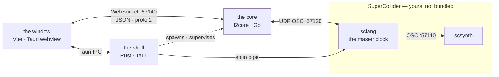
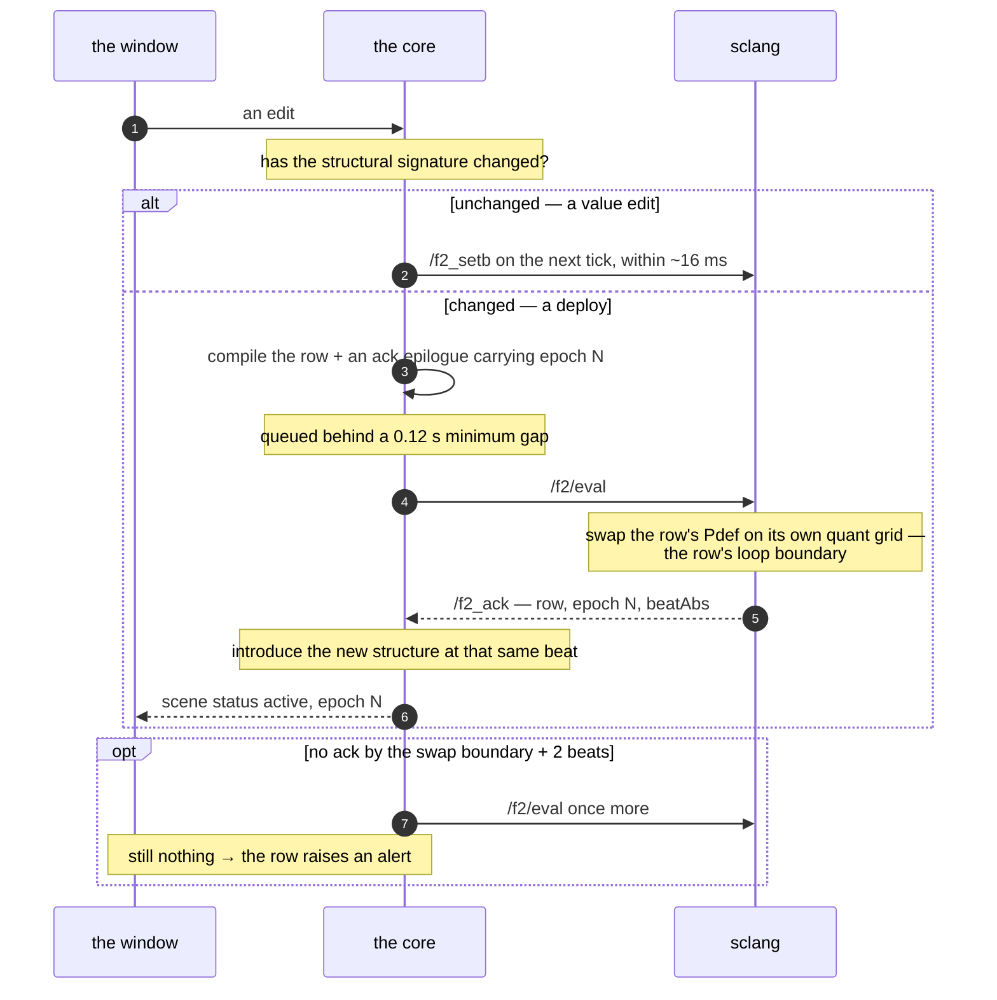

# Architecture

Four processes, three clocks, one authority per fact. This page is what you need before
[[Diagnostics]] makes sense, and before you can reason about why an edit took effect on the
next loop boundary rather than immediately.

---

## 1. The processes



**The window** (Vue 3 + Pinia in the Tauri webview) owns the document you are editing and
nothing else. It compiles nothing and schedules nothing. It sends the document and
*intents*; it receives transport, ghost values and scene statuses. Everything it draws that
moves is telemetry.

**The shell** (Rust, Tauri) owns the file system and the two child processes. It finds
`sclang`, starts it, pipes code to its stdin, reads its stdout, watches the project folder,
and spawns `f2core`. It has no opinion about music.

**The core** (`f2core`, a single Go binary, run as a Tauri sidecar) owns the semantics:
building sessions from the document, compiling rows to sclang programs, the modulation tick,
the channel store, deploy epochs, and the UI gateway. Everything in [[Scopes]], [[Windows]],
[[Forms]] and [[Value Composition|Value-Composition]] is computed here.

**The engine** (`sclang` driving `scsynth`) owns the sound: SynthDefs, the voice pools, the
buses, the effects rack. It is also the **master clock**.

> SuperCollider is not bundled. F2 drives the installation on your machine; if it cannot
> find `sclang` nothing boots. See [[Project Structure|Project-Structure]].

---

## 2. Threads, and what can stall

There are five places where work happens concurrently. Two of them can stall you, and they
stall in recognisable ways.

| where | what runs there | if it stalls |
|---|---|---|
| core — the tick goroutine | `Conductor.Tick` at 60 Hz; the UI flush every second tick | modulation freezes at its last value; audio keeps playing |
| core — the bridge goroutine | a blocking `ReadFromUDP` loop, dispatching OSC from sclang | the transport anchor goes stale and `beat` free-runs on the last tempo estimate |
| core — the gateway goroutines | the WS listener and one goroutine per connection | the window goes blank of telemetry; sound is unaffected |
| shell — the supervisor thread | waits on `f2core`, restarts it on exit | see §6 |
| **sclang — the interpreter** | **single-threaded**: OSC handlers, the eval queue, every `Routine` | **everything queues behind it** |

The last row is the one that matters in practice. sclang runs one interpreter thread, so a
long `interpret` — a project content boot loading a hundred SynthDefs takes seconds — blocks
OSC handling, the eval drain and every `Routine` for its whole duration. The engine is built
around that fact rather than against it: `/f2/eval` does not skip a dense eval, it **queues**
it, and one drain routine preserves arrival order. A watchdog stamps `busyAt` on each item
and raises a new drain if the queue is non-empty and silent for more than 10 s, because a
`CmdPeriod` (panic) kills the drain routine without raising, and `busy` would otherwise stay
true forever.

Inside the core, the conductor is one mutex over everything — rows, the eval queue, the
harmony engines. Its callbacks (`OnAlert`, `OnAcked`, `OnUIFrame`) are invoked **after** the
lock is released, so they may call back into the conductor without deadlocking.

---

## 3. Clocks

There are three clocks and they are not peers.

**SuperCollider's `TempoClock` is the master.** It is the only clock that decides when a
note happens.

**The core extrapolates.** sclang sends `/f2_sync <beatAbs> <elapsed>` periodically; the core
anchors on the *local monotonic arrival time* of that message and estimates tempo as an EWMA
(α = 0.25) over consecutive anchors. Between anchors, `beat = anchorBeat + (now − anchorTime)
× tempo`. Before the first `/f2_sync` the estimate is 2 beats per second — 120 BPM — and
`Synced()` is false, which gates the eval queue: sending a deploy before sclang is flowing
would fire a datagram at a handler that does not exist yet.

**The window's clock is decorative.** It extrapolates loop phase from the last `transport`
event purely to animate the playhead. No timer in the UI participates in scheduling —
launching, stopping and hot-reloading are all quantised against the core's transport.

### The row grid

A row does not live on an implicit "origin ≡ 0 mod L" grid. It carries an explicit
`RowGrid{L, Origin, Epoch}`:

- `Iter(beat) = floor((beat − Origin) / L)`
- `Phase(beat) = frac((beat − Origin) / L)`
- a change of loop length **rebases**: the new grid's origin is the next boundary of the
  **old** grid strictly after the current beat, and `Epoch` increments.

That explicitness is what closes a whole class of bug — a swap landing on someone else's
beat — by construction rather than by care.

---

## 4. The tick

Every 1/60 s the core does one pass:

1. read `beat` from the transport;
2. `Conductor.Tick(beat, now)` — for every playing row, advance its `RowStream`: phase →
   iteration → variant → scope windows → the modulation frame → composition → channel
   values. Then diff against the previous tick and send only what changed;
3. every second tick, flush a UI frame to the gateway (~30 Hz).

Delivery to sclang is a **diff**. Smoothness flags go **before** values in the same datagram,
so a smoother's lag is already correct when the value it applies to arrives. Two transports
exist for it:

- the default pair `/f2_setflags` + `/f2_setb`;
- `-frames` (`F2_CORE_FRAMES=1`): one sequenced `/f2_frame` bundle per tick. `seq` is
  monotonic and sclang drops stale or duplicate frames; a `beat` in the future is applied
  with `schedAbs` exactly on that beat, otherwise immediately.

Values cross the wire as OSC float32, matching the old npm `osc` backend. The **beat** does
not: `/f2_frame` and `/f2_setbt` carry it as an OSC double (`osc.Float64Arg`), because it is
the one value SuperCollider *schedules* on. A float32 has 24 mantissa bits, so its
representable step grows with uptime — about 2 ms at 120 bpm eight hours in, and a whole beat
past 2^24 — and rounding a `schedAbs` target by a drifting millisecond is the opposite of
what `schedAbs` is for. sclang reads the argument positionally, so the tag costs it nothing.

A datagram is chunked at 7000 bytes. That limit is not decoration: a full base for a large
scene in one packet exceeded the UDP maximum and was dropped silently.

---

## 5. Deploys and ack epochs

This is the part worth understanding, because it is the reason an edit sometimes takes effect
"on the next loop" and sometimes immediately.

Every edit is classified by a **structural signature**. If the signature is unchanged, the
edit is a **value**: it rides the next tick as a channel write and you hear it within ~16 ms.
If the signature changed, the edit is **structural** and goes through a deploy:

1. the core compiles the row to a sclang program and appends an **ack epilogue** carrying an
   epoch number;
2. the program enters the eval queue, which enforces a minimum gap of 0.12 s between evals;
3. sclang swaps the row's `Pdef` on its own `quant` grid — the row's loop boundary — and
   sends `/f2_ack <row> <epoch> <beatAbs>`;
4. the core introduces the new structure into its own engine at **that same confirmed
   boundary** (`ScheduleStructureAt`). A late ack is handled on the next tick.

If no ack arrives within the expected swap boundary plus 2 beats of grace, the eval is
retried once; if that also fails, the row raises an alert you will see in the scenes panel
and in [[Diagnostics]].



Both halves therefore introduce the change at the same beat. That is what keeps SC's notion
of iteration and the core's notion of window phase from drifting apart — the failure that
would show up as "the audible cell got only its base value, and the modulation was composed
for a different one".

---

## 6. Discovery, supervision and restart

Nothing about the ports is statically configured except two defaults.

**The core registers itself with sclang.** On start it sends `/f2/core_hello <port>` from its
own socket; `f2_remote_eval` remembers the address, mirrors `/f2_sync` there, and sends acks
back to it. The core's inbound port is ephemeral by default. The hello is re-sent every 2 s
until sync flows, and again whenever sync has been silent for more than 3 s — which is how a
restart of SuperCollider is detected and recovered from.

**The bridge learns sclang's real port.** sclang's outbound `langPort` is not always 57120,
so the core switches its send target to the **source address of the first `/f2_sync`** it
receives.

**The shell supervises the core.** If `f2core` exits, it is restarted with exponential
backoff starting at 1 s, doubling, capped at 30 s, and reset to 1 s on a successful start.
There is no legacy fallback path: without the core, rows cannot deploy at all. Set
`F2_CORE_EXTERNAL=1` to run the core by hand and have the shell keep its hands off.

**The window reconnects.** If the WebSocket drops, it retries every second. The first frame
of a connection is `hello {proto: 2}`, which is how a stale front-end bundle is detected
rather than silently mis-parsing.

---

## 7. The wire protocols

### Window ⇄ core — WebSocket, JSON, proto 2

Intents, keyed by `op`:

| op | payload | effect |
|---|---|---|
| `doc.globals` | presets, paramRange, paramLayers, bpm, harmonyFreqBus | playing rows are re-diffed: equal signature ⇒ live values, otherwise redeploy + ack |
| `scene.set` | row, col, sceneId, dur, blocks, tree | edits a scene's document; the active one hot-reloads |
| `scene.launch` | row, col, optionally an inline scene | starts a row, quantised to its grid |
| `scene.stop` | row | |
| `chan.set` | key, value | a knob: a direct channel write, no document round trip |
| `hush` | — | panic stop |

Events, keyed by `ev`: `hello`, `transport` (~30 Hz), `ghost` (~30 Hz per playing row —
modulated values, modulator outputs, active cell ids), `scene` (status `pending` / `active` /
`stopped` / `alert`), `maps` (the ghost translation tables after a hot edit), `err`.

### Core ⇄ sclang — UDP OSC

Inbound from sclang: `/f2_sync` (the clock anchor), `/f2_cell` (cell telemetry), `/f2_branch`
(a random choice made at demand time), `/f2_ack`, `/f2_chan` (unit telemetry →
`sc:<name>` channels, with a 0.5 s TTL so a writer that goes quiet drops its channel rather
than leaving a stale value), `/f2_head` (sampler playheads), `/f2_fxsync` and `/f2_dirty`
(sclang re-seeded state itself; forget the diffs and re-send).

Outbound to sclang: `/f2/eval` (a program; code above a threshold travels as a `.scd` file
that sclang `.load`s, because a large block over a pipe is not reliable), `/f2_setb`,
`/f2_setflags`, `/f2_setbt`, `/f2_choice` (the branch the engine picked, so SC plays exactly
that variant), `/f2_frame`, `/f2/hush`.

### Shell ⇄ sclang

A stdin pipe. Short commands go through it directly; a deploy is written to a temp `.scd`
file and sclang is told to `.load` it. See [[Shell]] — that is the same path your typed
commands take.

---

## 8. Environment variables

| variable | default | meaning |
|---|---|---|
| `F2_SCLANG` | auto | path to the `sclang` binary when the search fails |
| `F2_SC_DIR` | bundled | directory of the `sc/*.scd` engine files |
| `F2_SC_ADDR` | `127.0.0.1` | where `scsynth` is |
| `F2_SC_OUT_PORT` | `57120` | sclang's OSC port |
| `F2_CORE_BIN` | auto | path to the `f2core` sidecar |
| `F2_CORE_WS_PORT` | `57140` | the core's WebSocket gateway |
| `F2_CORE_EXTERNAL` | off | do not spawn the core; attach to a running one |
| `F2_CORE_FRAMES` | off | per-tick `/f2_frame` delivery instead of setb/setflags |
| `F2_TRACE` | off | verbose tracing |

Running the core by hand, which is what `F2_CORE_EXTERNAL=1` is for:

```bash
go run ./core/cmd/f2core -serve -v            # 60 Hz tick, WS :57140, ephemeral OSC in
go run ./core/cmd/f2core -serve -tickHz 120   # a finer modulation grid
go run ./core/cmd/f2core -serve -trace t.jsonl
```

---

## 9. Where a fact lives

When two places seem to disagree, this table says which one is right.

| fact | authority |
|---|---|
| the current beat | sclang's `TempoClock`; the core extrapolates it |
| what a row's structure is | the core, confirmed by an ack from sclang |
| a parameter's composed value | the core's channel store |
| whether a voice is alive | sclang's voice pool |
| what a preset sounds like | the SynthDef in sclang |
| the document | the window, until it is sent; the core thereafter |

See also: [[Diagnostics]], [[Windows]], [[Randomness]].
