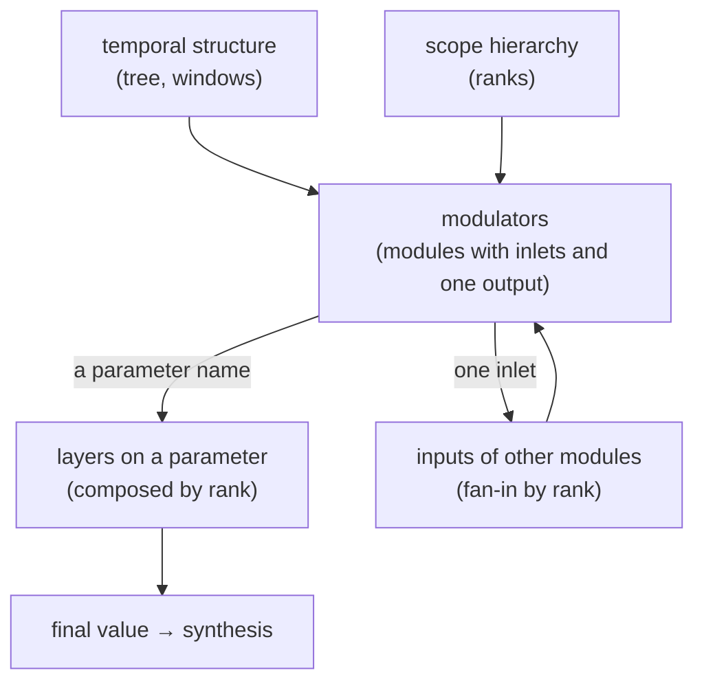

# Philosophy

What F2 does differently, in one page. Everything else in the wiki is a consequence of this.

---

## 1. The inversion

In a modular synthesizer a module runs continuously. An LFO oscillates for as long as it has
power, and the question *when does this modulation act* is answered by something outside the
patch — a VCA, a gate, a sequencer. Time is a resource the patch consumes.

F2 inverts that. **Time is a structural property of the patch itself.** Every modulator
belongs to a node of the temporal structure — a **scope** — and that node defines a
**window**: the interval of loop phase inside which the modulator exists at all. Outside its
window the modulator's output is not zero and not held; it is **absent as an object**, and
everyone who was reading it falls back to their own value.

Three things follow, and they are the practical difference:

**A form always lives a complete life.** A ramp assigned to a scope travels `from → to` in
exactly the duration of that scope's window, however short. The same ramp on a whole-loop
window is a slow sweep; on one cell of a sixteen-cell block it is a click-gesture. Forms are
described in phase, not in seconds — so the *rhythmic* structure and the *modulation*
structure cannot drift apart, because they are the same structure.

**Modulation cannot stick.** The classic failure of a released gate — a parameter frozen at
the last CV value — does not exist here. Closing a window removes the contribution and the
target returns to its base, or to whatever a senior scope is contributing. There is no
"release" to get wrong.

**Branching the sequence branches the patch.** When a random container picks one of its
children, it is not only choosing what plays; the modulators of the branch it did not pick
never open their windows, so they are not part of the patch this iteration. A conditional
patch is a free consequence of a conditional sequence.

---

## 2. Three dimensions

The system has exactly three axes and everything is addressed on them.

**Time** — the [[Tree Operators|Tree-Operators]] divide a loop's phase among their children.
That division is the rhythm and it is also the window layout.

**Rank** — the [[Scopes]] hierarchy (preset → tree node → block → cell) says who wins when
two declarations touch the same parameter. One rule, everywhere: **the deeper scope
overrides the more senior one.** It applies identically to base values, to modulation layers,
and to several writers of one inlet.

**Addressing** — a modulator's output goes either to a **parameter name** (a layer over
every cell in the scope's range whose preset has that parameter) or to **one inlet of one
other modulator** (point addressing by a stable id). Every kind of modulator can do both.
See [[Routing]].

---

## 3. Everything is a channel

There is one namespace underneath all of it. A composed parameter value is a channel
(`=param`). A modulator's own output is a channel (`@uid`). A scope's window is a channel
(`~win`) — so *the fact that a window is open* is itself a signal you can read, which is how
clocks and onset counters are built without a clock primitive. A macro knob is a channel
(`m:k`). Telemetry a SuperCollider unit publishes is a channel (`sc:name`).

Anything that is a channel can be listened to by anything that reads a channel, across rows
and across scopes. That is why F2 needs no special cases for sidechaining, for cross-row
modulation or for feeding an analysis signal back into the sequencer: they were never
separate features.

---

## 4. Determinism

Randomness in F2 is **seeded and reproducible**. A `rand` container's choice, a `dice` form's
throw, the variant of an iteration — each is a pure function of a seed derived from the row,
the scene, the iteration, the epoch and the node's own identity. The same document at the
same iteration produces the same music.

Two consequences worth stating. First, the core can tell SuperCollider which branch it picked
(`/f2_choice`) and be certain SC plays that one, rather than both sides rolling their own dice
and diverging. Second, a seed is an **inlet** — you can modulate it, which turns "reproducible"
into an instrument rather than a limitation. See [[Randomness]].

---

## 5. What F2 is not

It is not a linear DAW with a timeline you scrub. There is no arrangement view that owns the
truth; a scene is a loop and the structure is a tree.

It is not a modular patcher with a cable for every connection. Routing is by **name and
rank**, not by wire, because a wire cannot express "this contribution exists during this
window at this rank".

It does not ship its own synthesis. The instruments are SynthDefs in `sc/`, written against a
short [[Writing Synths|contract|Writing-Synths]], and you are expected to read and edit them.
The built-in library ([[Synth Modules|Synth-Modules]]) is written against the same contract
with no privileges.

It does not hide the engine. The [[Shell]] is a live sclang prompt into the same interpreter
that is making the sound.

---

## 6. The design rules this implies

These are stated once here and then assumed everywhere else in the wiki.

1. **A window that closes removes a contribution; it never freezes one.**
2. **The deeper scope wins.** No exceptions, no per-feature precedence tables.
3. **Structure changes on a confirmed boundary; values change on the next tick.** See
   [[Architecture]] §5.
4. **Randomness is a function of a seed, and the seed is addressable.**
5. **The same document produces the same audio in both engines.** The Go core and the
   TypeScript preview implement the same semantics and are held to it by golden tests; where
   they differ, the core is the one that plays.
