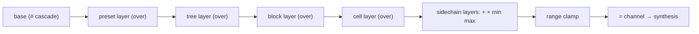

# Value Composition

How a cell's final parameter value is assembled, and how an inlet with several writers
resolves. **The two are the same rule**, which is the point of this page.

---

## 1. Layers on a parameter

A cell's final value for a parameter is built in this order:

1. **Base** — the cascade of `#` channels from the cell up to the preset ([[Scopes]] §3).
2. **Layers** of every modulator whose scope lies on the cell's path, plus the preset layer,
   sorted **by rank: senior first, junior later**.
3. Each layer applies with its **combine mode**.
4. Layers in a non-`over` mode apply **on top of all the `over` layers**, regardless of the
   scope they were declared at.
5. The result is **clamped** to the parameter's range, if one is declared, and published into
   the cell's `=` channel.

### Combine modes

| mode | symbol | semantics |
|---|---|---|
| `over` | over | replace the accumulated value — **base-reactive** |
| `sum` | + | add |
| `mul` | × | multiply — ducking, sidechain |
| `min` | min | element-wise minimum — hard ducking |
| `max` | max | element-wise maximum — a ceiling |

**Base-reactive** is worth a sentence. An `over` layer does not pin the parameter to an
absolute number: a live shift of the knob moves the *centre* of the modulation. The override
replaces the value while still following the base's change relative to the point it was
computed against — so turning the knob under a running modulation does what you expect rather
than doing nothing.

---

## 2. A worked example

Parameter `grPos`, base **0.20**. Four layers:

| layer | scope | mode | value |
|---|---|---|---|
| a lag gate | preset | over | 0.30 |
| a ramp | block | over | 0.55 |
| a dice jitter | block | `+` | +0.07 |
| a ramp | cell `c:3` | over | 0.10 |

**Cell `c:3`, inside its window:**
`0.20 → gate 0.30 → block ramp 0.55 → cell ramp 0.10` (junior rank overrides)
`→ sidechain +0.07` → **0.17**

**Every other cell** (the `c:3` window is closed):
`0.20 → 0.30 → 0.55 → +0.07` → **0.62**

Note that the `+` layer landed on top of the `over` chain's result in both cases, regardless of
the scope it was declared at. That is rule 4, and it is what makes a sidechain a sidechain
rather than just another override.

---

## 3. Inlet fan-in

When one inlet receives several writers, **the same rank rule applies**:

- writers are ordered by scope rank (ties broken by declaration order);
- `over` writers reduce by "last wins" — that is, **the deepest scope**;
- writers in `+`, `×`, `min`, `max` modes apply on top of that result, in the same rank order;
- in addition, an inlet may carry a **channel subscription** ([[Routing]] §3): the channel is
  applied over the inlet's own constant with its mode, and **in-patch writers take precedence
  over the subscription**.

Continuing the example: if the block ramp and the cell ramp are routed into the gate's `value`
inlet rather than being layers, the rule is identical — inside the `c:3` window the inlet reads
0.10, outside it reads 0.55, and the gate itself remains the only layer on the parameter.

> **Parameter layers and inlet fan-in are resolved by one and the same rank logic.** Learn it
> once and you can predict any point in the system.

---

## 4. The scope bus

The left panel shows exactly this, for whatever is selected:

- the **base** at the top;
- every **layer** in rank order, with its scope colour, its mode symbol and its live value;
- the **composed result** at the bottom, which is what synthesis receives.

A layer whose window is closed is drawn but inactive — which is how you see, rather than
deduce, that a value came from the block because the cell's window is shut.

### The value stack versus the param inspector

They show the same data with different intent. The **bus** is for reading: it is always
showing the selection and it updates live. The **inspector** (click a knob's *label*) is for
editing: drag a layer between scopes with ⌥, duplicate it, copy or cut the stack.

---

## 5. Clamping and ranges

The final value is clamped to the parameter's range when one is declared. Ranges come from
three places, in order of precedence: the engine's exported `unitSpecs`, the app's static
tables for the three big source cards, and the block fallback tables for the processors. A
user range set by right-clicking a knob (`paramRange`) overrides the working span the knob and
the modulator swings are expressed in.

A clamp is not a failure — but a parameter that sits permanently at its bound usually means a
swing was computed against a different range than the one the knob now has. See
[[Diagnostics]].

See also: [[Scopes]], [[Routing]], [[Windows]].
